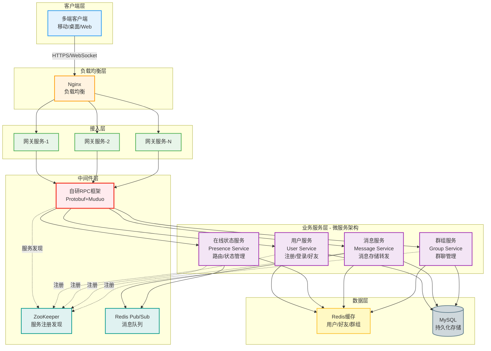
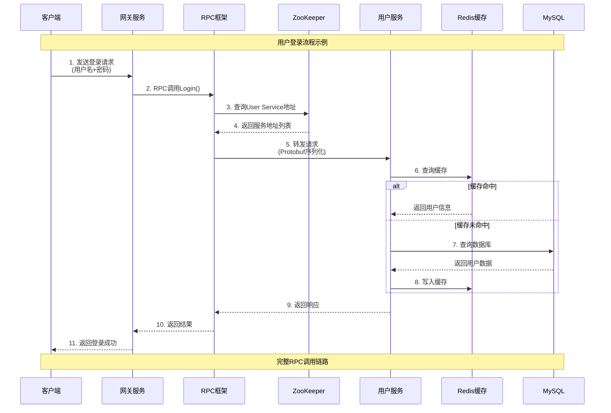
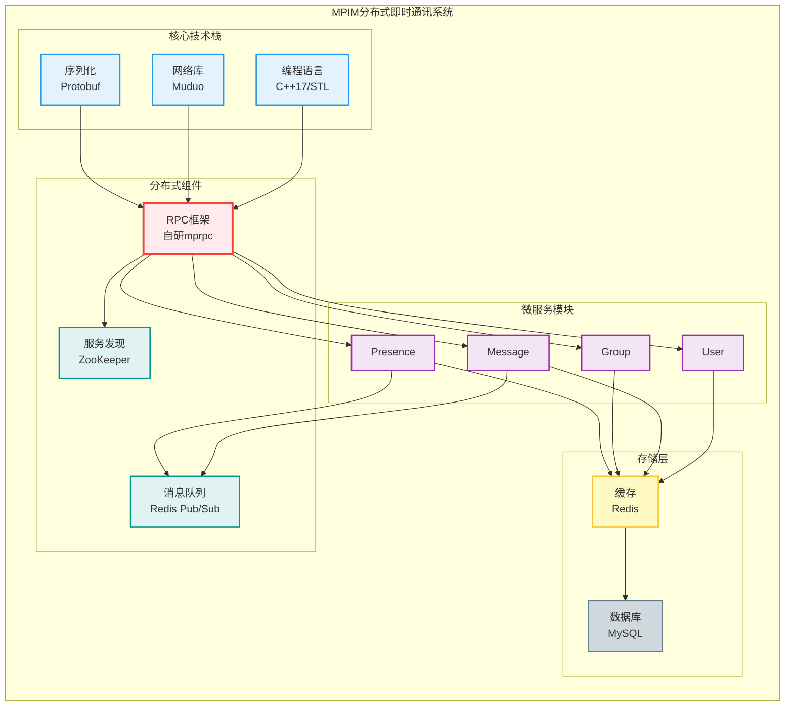
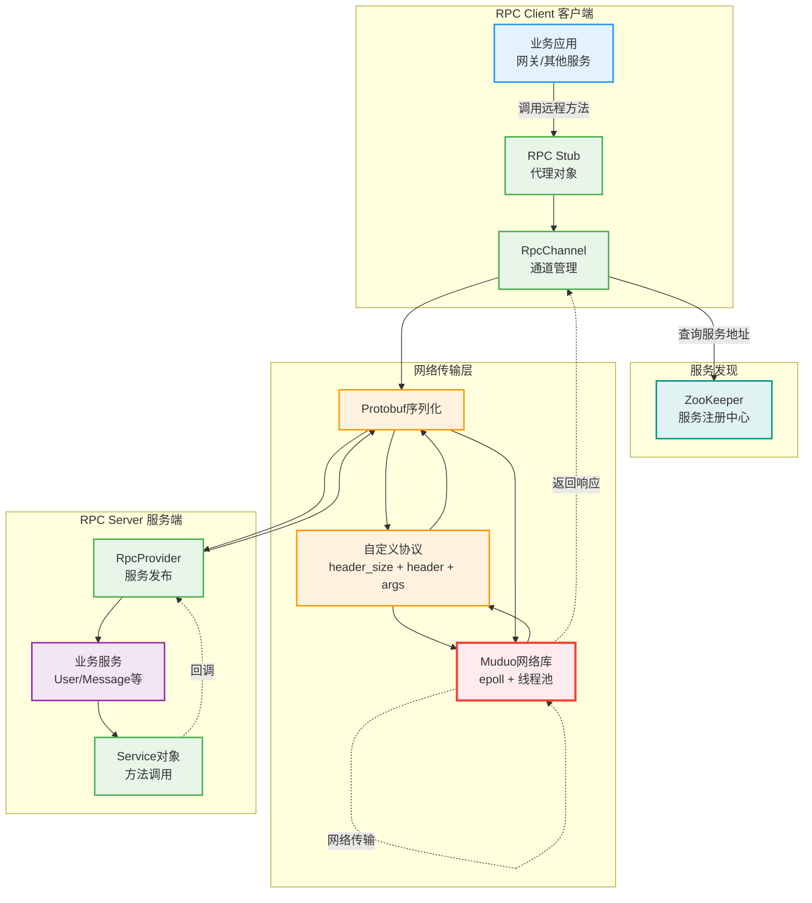

# MPIM项目架构图（PPT版）

> 复制到 https://mermaid.live 预览和导出PNG

---

## 方案1：系统整体架构（推荐用于PPT）



---

## 方案2：分层架构图（简洁版）

```mermaid
graph TB
    subgraph "Layer 1: 客户端层"
        C[客户端<br/>Android/iOS/Web/Desktop]
    end
    
    subgraph "Layer 2: 接入层"
        LB[Nginx负载均衡]
        GW[网关服务集群<br/>Muduo网络库]
    end
    
    subgraph "Layer 3: 业务层"
        direction LR
        SVC[微服务<br/>User | Presence | Message | Group]
    end
    
    subgraph "Layer 4: 中间件层"
        direction LR
        MW1[自研RPC框架]
        MW2[ZooKeeper]
        MW3[Redis MQ]
    end
    
    subgraph "Layer 5: 数据层"
        direction LR
        DATA1[Redis缓存]
        DATA2[MySQL数据库]
    end
    
    C --> LB
    LB --> GW
    GW --> SVC
    SVC --> MW1
    SVC --> MW2
    SVC --> MW3
    SVC --> DATA1
    SVC --> DATA2
    
    style C fill:#E3F2FD,stroke:#2196F3,stroke-width:3px
    style LB fill:#FFF3E0,stroke:#FF9800,stroke-width:3px
    style GW fill:#E8F5E9,stroke:#4CAF50,stroke-width:3px
    style SVC fill:#F3E5F5,stroke:#9C27B0,stroke-width:3px
    style MW1 fill:#FFEBEE,stroke:#F44336,stroke-width:3px
    style MW2 fill:#E0F2F1,stroke:#009688,stroke-width:3px
    style MW3 fill:#E0F2F1,stroke:#009688,stroke-width:3px
    style DATA1 fill:#FFF9C4,stroke:#FBC02D,stroke-width:3px
    style DATA2 fill:#CFD8DC,stroke:#607D8B,stroke-width:3px
```

---

## 方案3：RPC调用流程图



---

## 方案4：消息流转架构图

```mermaid
graph LR
    subgraph "发送方"
        S[用户A客户端]
    end
    
    subgraph "网关层"
        GW1[网关服务-1]
    end
    
    subgraph "业务服务"
        MS[消息服务]
        PS[在线状态服务]
    end
    
    subgraph "消息队列"
        MQ[Redis Pub/Sub]
    end
    
    subgraph "数据存储"
        CACHE[Redis缓存<br/>离线消息]
        DB[(MySQL<br/>消息历史)]
    end
    
    subgraph "接收方"
        GW2[网关服务-2]
        R[用户B客户端]
    end
    
    S -->|1. 发送消息| GW1
    GW1 -->|2. RPC调用| MS
    MS -->|3. 查询在线状态| PS
    
    MS -->|4. 持久化| DB
    
    alt 用户B在线
        PS -->|5a. 推送| MQ
        MQ -->|6a. 订阅| GW2
        GW2 -->|7a. 实时推送| R
    else 用户B离线
        MS -->|5b. 存储离线消息| CACHE
    end
    
    style S fill:#E3F2FD,stroke:#2196F3,stroke-width:2px
    style GW1 fill:#E8F5E9,stroke:#4CAF50,stroke-width:2px
    style GW2 fill:#E8F5E9,stroke:#4CAF50,stroke-width:2px
    style MS fill:#F3E5F5,stroke:#9C27B0,stroke-width:2px
    style PS fill:#F3E5F5,stroke:#9C27B0,stroke-width:2px
    style MQ fill:#FFEBEE,stroke:#F44336,stroke-width:2px
    style CACHE fill:#FFF9C4,stroke:#FBC02D,stroke-width:2px
    style DB fill:#CFD8DC,stroke:#607D8B,stroke-width:2px
    style R fill:#E3F2FD,stroke:#2196F3,stroke-width:2px
```

---

## 方案5：技术栈架构图（展示技术选型）



---

## 方案6：mprpc框架架构图



---

## 使用建议

### PPT中使用哪个图？

| 图表 | 适用场景 | 推荐度 |
|-----|---------|--------|
| **方案1：系统整体架构** | 项目概览，展示完整系统 | ⭐⭐⭐⭐⭐ 强烈推荐 |
| **方案2：分层架构** | 简洁展示，时间有限 | ⭐⭐⭐⭐ |
| **方案3：RPC调用流程** | 讲解技术细节，调用链路 | ⭐⭐⭐⭐⭐ 讲RPC时必用 |
| **方案4：消息流转** | 讲解消息推送机制 | ⭐⭐⭐ |
| **方案5：技术栈架构** | 展示技术选型和组件关系 | ⭐⭐⭐ |
| **方案6：mprpc框架** | 深入讲解RPC框架设计 | ⭐⭐⭐⭐⭐ 讲RPC时必用 |

### 建议的PPT使用方案：

```
第2部分（项目概览）
  → 使用 方案1：系统整体架构

第3部分（职责与贡献）
  → 使用 方案5：技术栈架构

第4部分（技术难点 - RPC框架）
  → 使用 方案6：mprpc框架架构
  → 使用 方案3：RPC调用流程

第4部分（技术难点 - 消息推送）
  → 使用 方案4：消息流转架构
```

---

## 如何导出PNG用于PPT

### 方法1：Mermaid Live Editor（推荐）
1. 打开 https://mermaid.live/
2. 复制上面的Mermaid代码
3. 粘贴到左侧编辑器
4. 右侧实时预览
5. 点击 **Actions** → **PNG** → 下载高清图片
6. 插入到PPT中

### 方法2：Typora编辑器
1. 安装Typora（支持Mermaid渲染）
2. 复制代码到Typora
3. 右键图表 → 导出为图片

### 方法3：在线工具
- https://kroki.io/
- https://mermaid.ink/

---

## 配色说明

图中使用的配色方案：

- **蓝色系** (#E3F2FD) - 客户端层
- **绿色系** (#E8F5E9) - 网关/接入层
- **紫色系** (#F3E5F5) - 业务服务层
- **红色系** (#FFEBEE) - RPC框架（核心）
- **青色系** (#E0F2F1) - 中间件（ZooKeeper/Redis MQ）
- **黄色系** (#FFF9C4) - 缓存层
- **灰色系** (#CFD8DC) - 数据库层

这些颜色在PPT中显示效果良好，建议保持。

