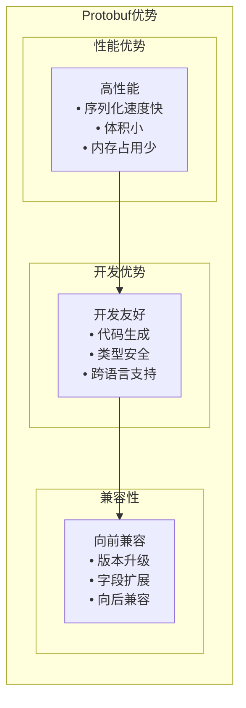
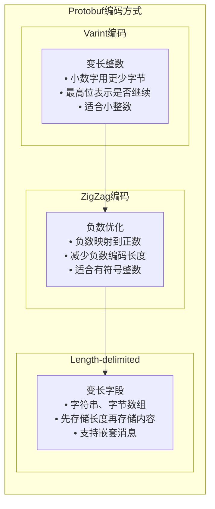
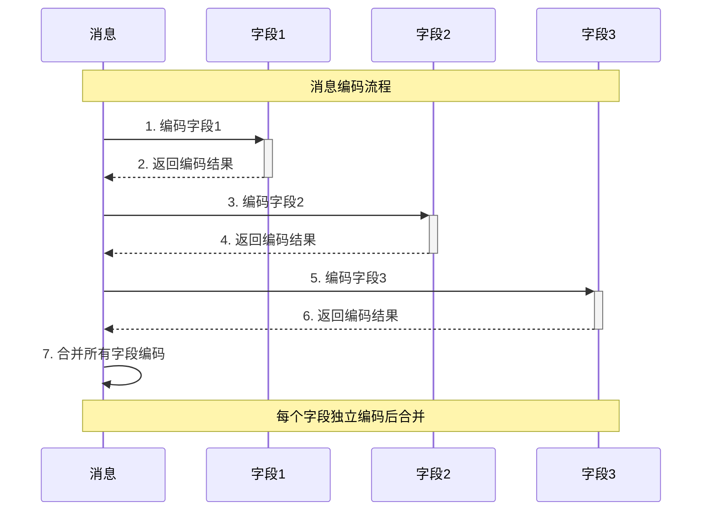
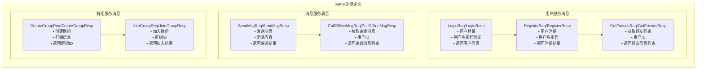
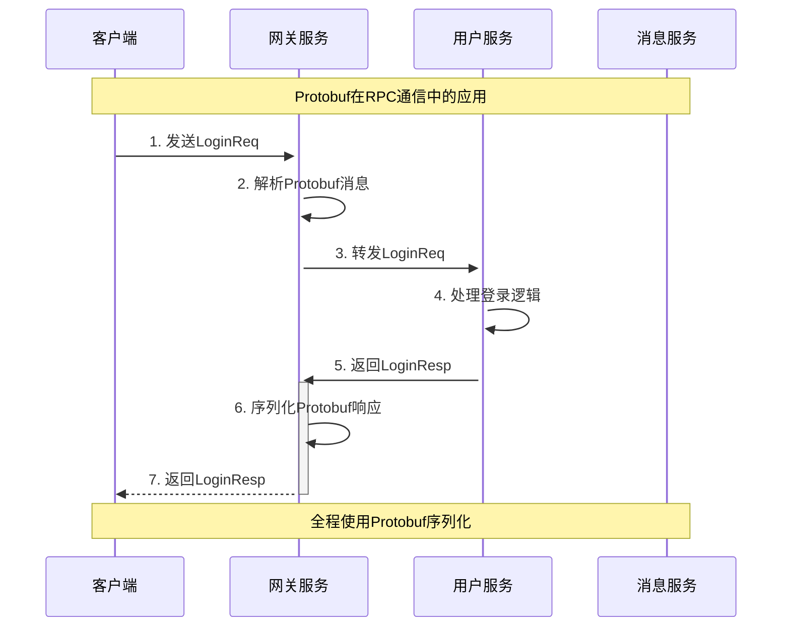
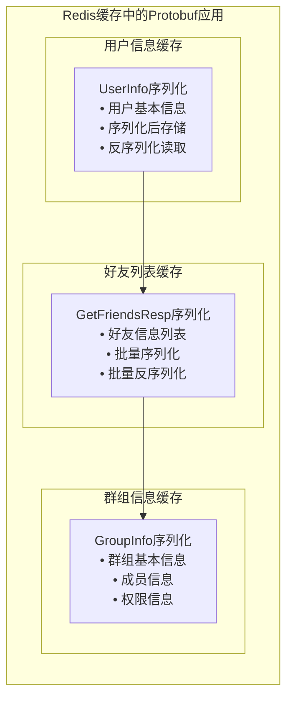
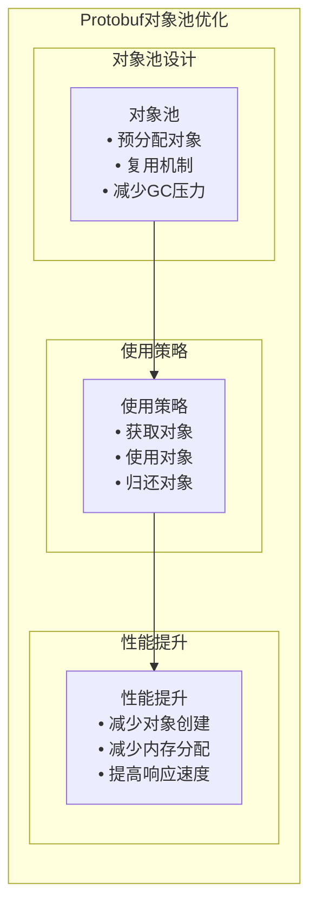
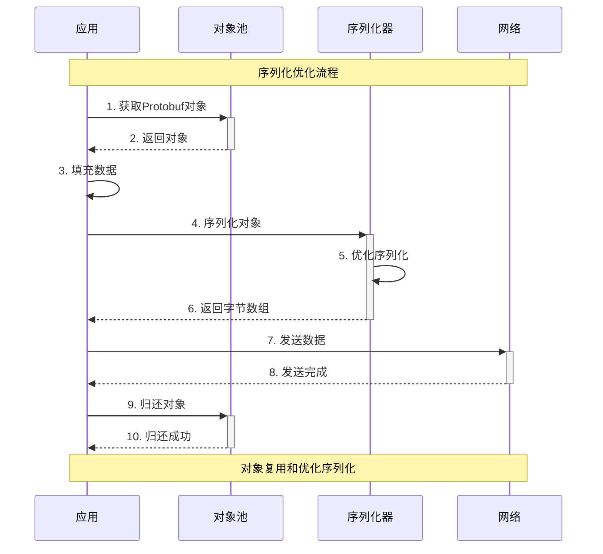
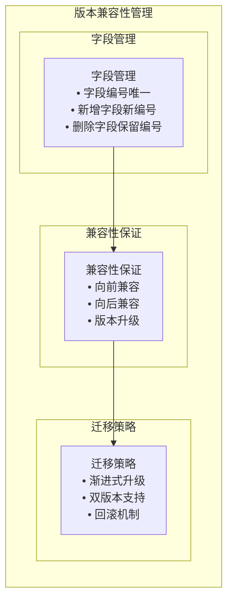
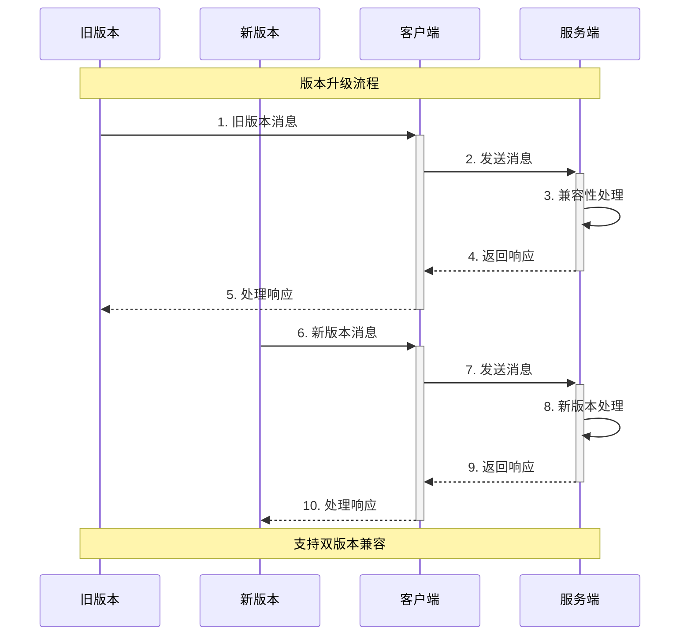

# Protobuf在MPIM项目中的应用分析

## Protobuf基础概念

### 什么是Protobuf？

Protocol Buffers（Protobuf）是Google开发的一种语言无关、平台无关、可扩展的序列化结构数据的方法。它用于结构化数据的序列化，很适合做数据存储或RPC数据交换格式。

### Protobuf的核心优势

**核心优势**：
- **高性能**：比JSON快3-5倍，体积小30-50%
- **类型安全**：编译时检查，避免运行时错误
- **跨语言**：支持C++、Java、Python、Go等
- **向前兼容**：支持版本升级和字段扩展

## Protobuf编码原理

### 1. 基本编码方式

**编码方式详解**：

| 编码类型 | 适用场景 | 编码方式 | 示例 |
|----------|----------|----------|------|
| Varint | 整数类型 | 变长编码，最高位为1表示继续 | 300 → 0xAC 0x02 |
| ZigZag | 有符号整数 | 负数映射到正数后Varint编码 | -1 → 1 → 0x02 |
| Length-delimited | 字符串、字节数组 | 长度+内容 | "hello" → 0x05 0x68 0x65 0x6C 0x6C 0x6F |

### 2. 消息结构编码

**消息编码结构**：
- **字段标识**：字段编号 + 字段类型（3位）
- **字段值**：根据类型进行相应编码
- **字段顺序**：按字段编号排序

## MPIM项目中的Protobuf应用

### 1. 消息定义

### 2. 服务间通信

**RPC通信流程**：
1. **客户端**：构造Protobuf请求消息
2. **网关服务**：解析并转发请求
3. **业务服务**：处理业务逻辑，构造响应
4. **网关服务**：序列化响应消息
5. **客户端**：反序列化响应消息

### 3. 缓存存储应用

**缓存应用场景**：
- **用户信息**：`UserInfo`对象序列化后存储
- **好友列表**：`GetFriendsResp`序列化后存储
- **群组信息**：`GroupInfo`序列化后存储
- **在线状态**：用户状态信息序列化存储

## 性能优化策略

### 1. 对象池优化

**优化策略**：
- **对象池**：预分配Protobuf对象，避免频繁创建
- **批量操作**：批量序列化/反序列化
- **字段优化**：选择合适的字段类型
- **避免嵌套**：减少不必要的字段嵌套

### 2. 序列化优化

## 版本兼容性管理

### 1. 向前兼容策略

**兼容性策略**：
- **字段编号**：每个字段使用唯一编号
- **新增字段**：使用新编号，标记为optional
- **删除字段**：保留编号，标记为reserved
- **类型变更**：避免改变字段类型

### 2. 版本升级流程

## 面试常见问题

### 1. 基础概念问题

**Q: 为什么选择Protobuf而不是JSON？**
A: 主要考虑性能优势：
- 序列化速度比JSON快3-5倍
- 数据体积比JSON小30-50%
- 二进制格式，解析效率高
- 类型安全，编译时检查

**Q: Protobuf的编码原理是什么？**
A: 采用多种编码方式：
- Varint编码：变长整数，小数字用更少字节
- ZigZag编码：负数优化，减少编码长度
- Length-delimited：变长字段，先存储长度再存储内容

### 2. 技术实现问题

**Q: 在MPIM项目中如何保证版本兼容性？**
A: 采用以下策略：
- 字段编号唯一性，避免冲突
- 新增字段使用新编号，标记为optional
- 删除字段保留编号，标记为reserved
- 支持渐进式升级，双版本兼容

**Q: 如何优化Protobuf的性能？**
A: 多种优化策略：
- 使用对象池避免频繁创建对象
- 批量序列化减少函数调用开销
- 选择合适的字段类型（int32 vs int64）
- 避免不必要的字段嵌套

### 3. 项目应用问题

**Q: 在MPIM项目中Protobuf的具体应用场景？**
A: 主要应用场景：
- RPC通信：所有服务间通信使用Protobuf
- 缓存存储：Redis中存储序列化后的数据
- 网络传输：客户端与服务端通信
- 数据持久化：部分数据以Protobuf格式存储

**Q: 如何处理Protobuf的序列化错误？**
A: 错误处理策略：
- 使用try-catch捕获序列化异常
- 验证消息格式的正确性
- 提供默认值和错误恢复机制
- 记录详细的错误日志

## 总结

Protobuf在MPIM项目中的应用具有以下特点：

### 1. 技术优势
- **高性能**：序列化速度快，数据体积小
- **类型安全**：编译时检查，减少运行时错误
- **跨语言**：支持多种编程语言
- **向前兼容**：支持版本升级和字段扩展

### 2. 项目应用
- **RPC通信**：所有服务间通信使用Protobuf
- **缓存存储**：Redis中存储序列化数据
- **网络传输**：客户端与服务端通信
- **数据交换**：不同模块间数据交换

### 3. 性能优化
- **对象池**：避免频繁创建对象
- **批量操作**：提高序列化效率
- **字段优化**：选择合适的字段类型
- **兼容性**：保证版本升级的平滑过渡

### 4. 面试要点
- 理解Protobuf的编码原理
- 掌握性能优化策略
- 了解版本兼容性管理
- 熟悉项目中的具体应用
